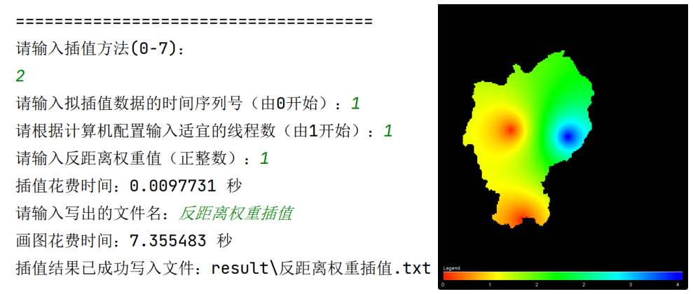
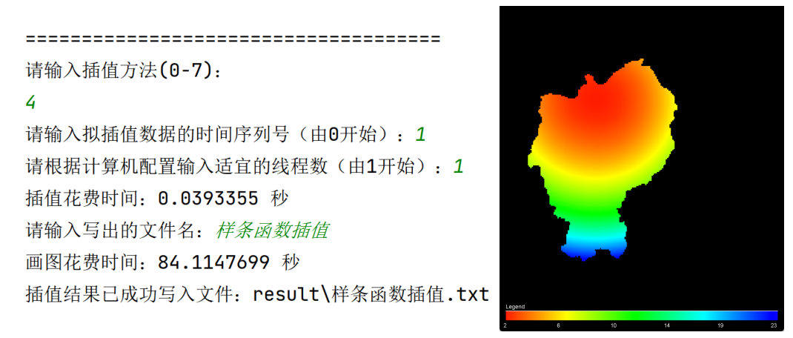

# **降水分析程序使用指南**

## **项目概述**

本程序针对于给定的高程栅格数据“dem.asc”、降雨量数据“rain.txt”和测站数据“StationProperty.txt”设计了基于Java网格计算的水文分析系统。本程序主要实现了四个板块的功能，第一部分是降水插值部分，包括7种插值方法；第二部分是数据库查询；第三部分是描述分析，包括变化检测与预测和一些简单的统计；水文分析部分，具体功能包括填洼计算、流向计算、坡度和坡向计算、降雨量插值计算、累积流计算、山谷线和河网提取。

图 1-1主要功能菜单展示

文件夹的主要结构是IDEA的目录组成

1. out <b>构建的jar工件</b>
2. result <b>所有算法的asc以及jpg输出结果</b>
3. src <b>源码文件</b>，package_for_gridanalysis为打包成package的代码文件,lib中为程序运行需要的jar包
4. data <b>运行数据文件</b>

## **环境配置**

（1）Java版本配置如下：

图 2-1Jdk版本

（2）需要使用的library，已在本项目文件的library和lib文件目录下。

图 2-2Library

## **程序指南**

下面将从欢迎界面依次进入不同分菜单进行演示。

### **进入降水分析程序**

点击运行Interface.java函数，可以看到欢迎界面如下，输入需要分析的文件路径及名称，这里的示例使用的是本程序的测试文件，在相对路径data目录下。

图 3-1欢迎界面，以及需要填入的信息

文字版:

> data/gauges.txt
>
> data/rainfall.txt
>
> data/domin.asc
>
> jdbc:mysql://localhost:3306/mysql
>
> root
>
> 自己主机MYSQL密码

进入程序后，会出现一个降水分析主菜单，包括四个板块的功能，插值计算、数据库查询、描述分析和水文分析。选择1-4会进入对应板块的菜单进行后续操作，直接按0将会退出程序，按0-4以外的字符，程序会提示重新输入，直到输入符合要求。

图 3-2主菜单

### **插值计算**

在主菜单中选择“1”，将会进入插值计算板块。“0”是返回到主菜单，“1-7”分别是|泰森多边形插值、反距离权重插值、克里金插值、样条函数插值、趋势面插值、自然领域插值、径向基函数插值。

图 3-3插值计算

#### **泰森多边形插值**

输入1，进入泰森多边形插值，需要输入插值数据的时间序列号后，根据用户自己的电脑的性能自行选择适宜的线程数。插值完后，控制台会打印出插值使用时间，之后用户输入保存的文件名，会弹出插值图像，文件将会自动写入项目路径下的result文件夹，一个.txt文件，一个彩色.jpg图像。

图 3-4泰森多边形

1. #### **反距离权重插值**

输入2，进入反距离权重插值，需要输入插值数据的时间序列号后，根据用户自己的电脑的性能自行选择适宜的线程数。再选择反距离权重值，插值完后，控制台会打印出插值使用时间，之后用户输入保存的文件名，会弹出插值图像，文件将会自动写入项目路径下的result文件夹，一个.txt文件，一个彩色.jpg图像。

图 3-5反距离权重

#### **克里金插值**

输入3，进入克里金插值，需要输入插值数据的时间序列号后，根据用户自己的电脑的性能自行选择适宜的线程数。再选择半变异函数，有三种模型可以选择，球状模型，指数模型和高斯函数模型。插值完后，控制台会打印出插值使用时间，之后用户输入保存的文件名，会弹出插值图像，文件将会自动写入项目路径下的result文件夹，一个.txt文件，一个彩色.jpg图像。

图 3-6克里金插值

#### **样条函数插值**

输入4，进入样条函数插值，需要输入插值数据的时间序列号后，根据用户自己的电脑的性能自行选择适宜的线程数。插值完后，控制台会打印出插值使用时间，之后用户输入保存的文件名，会弹出插值图像，文件将会自动写入项目路径下的result文件夹，一个.txt文件，一个彩色.jpg图像。

图 3-7样条函数插值

#### **趋势面插值**

输入5，进入趋势面插值，需要输入插值数据的时间序列号后，根据用户自己的电脑的性能自行选择适宜的线程数。再输入趋势面的阶数，插值完后，控制台会打印出插值使用时间，之后用户输入保存的文件名，会弹出插值图像，文件将会自动写入项目路径下的result文件夹，一个.txt文件，一个彩色.jpg图像。

图 3-8趋势面插值

#### **自然领域插值**

输入6，进入自然领域插值，需要输入插值数据的时间序列号后，根据用户自己的电脑的性能自行选择适宜的线程数。自然领域法插值时间略微较长，需要耐心等待一会，插值完后，控制台会打印出插值使用时间，之后用户输入保存的文件名，会弹出插值图像，文件将会自动写入项目路径下的result文件夹，一个.txt文件，一个彩色.jpg图像。

图 3-9自然领域插值

#### **径向基函数插值**

输入7，进入径向基函数插值，需要输入插值数据的时间序列号后，根据用户自己的电脑的性能自行选择适宜的线程数。再输入数字选择核函数，拟合函数的方差（建议10000左右），插值完后，控制台会打印出插值使用时间，之后用户输入保存的文件名，会弹出插值图像，文件将会自动写入项目路径下的result文件夹，一个.txt文件，一个彩色.jpg图像。

图 3-10径向基函数插值

### **数据库查询**

在主菜单中选择“2”，将会进入数据库查询板块。这个板块有三种查询方法，1.根据站点、时间查询降水量、2.根据站点ID查询雨量、3.根据站点名称统计降水量。

图 3-11数据库查询菜单 

#### **根据站点、时间查询降水量**

输入需要查询的站点名称，在输入需要查询的时刻，格式为YYYY-MM-DD HH:MM:SS。

图 3-12查询结果

### **根据站点ID查询雨量**

输入2，选择根据站点编号查询雨量站信息。输入站点的编号，将会查询到该站点的属性信息。

图 3-13查询结果

#### **根据站点名称统计降水量**

输入3，选择根据站点名称统计降水量，输入需要查询的站点名称，将会输出该站点降水量的统计结果。

图 3-14查询结果

### **描述分析**

在主菜单选择3，进入描述分析板块，输入0-3选择不同的功能，具体功能有1.MK变化检测、2.滑动自回归预测、3.统计。

图 3-15描述分析菜单

#### **MK变化检测**

选择1，进入MK变化检测部分，将会输出每个站点的趋势分析。

图 3-16MK变化检测

#### **滑动自回归预测**

选择2，进入滑动自回归预测功能。输入数字选择，是已有数据测试或者预测未来数据，再输入站点编号与需要预测的实践，控制台将会输出迭代的过程以及最后选择的参数与预测结果及其平均绝对误差，并弹出预测结果图。

图 3-17预测结果图

#### **统计**

选择3，进入统计板块。统计功能是对降水插值后的结果进行统计，所以进入统计功能后，以防先前未进行插值，所以先进入插值功能的选择。选择插值后将不会和先前插值一样选择保存文件等内容，而是直接计算得到对应插值结果的统计。统计完会让用户选择是否保存统计结果。

图 3-18统计

### **水文分析**

在主菜单选择4，进入水文分析板块，输入0-7选择不同的功能，具体功能有1.坡度计算、2.流向计算、3.填洼计算、4.累积流计算、5.山脊线提取、6.河网提取计算、7.坡向计算。

图 3-19水文分析菜单

输入1-7进入需要计算的功能进行计算，不同的是，累积流计算需要选择“是否使用插值结果作为权重”，计算完成后会输出提示语句“xx计算和输出完成”。输出的文件有三个，以对应操作功能的英文名称命名，分别是.asc文件、灰色版.jpg、彩色版.jpg文件，默认输出目录为相对路径“result\”。

图 3-20输入参数示意图（左图为其他功能计算，右图为累积流计算）

图 3-21输出结果总览

